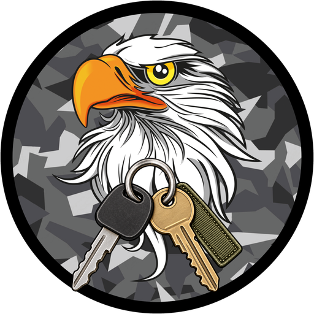
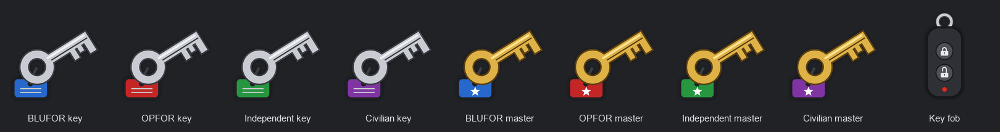
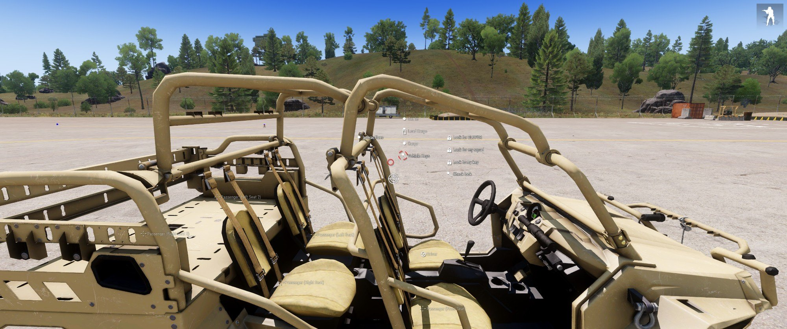
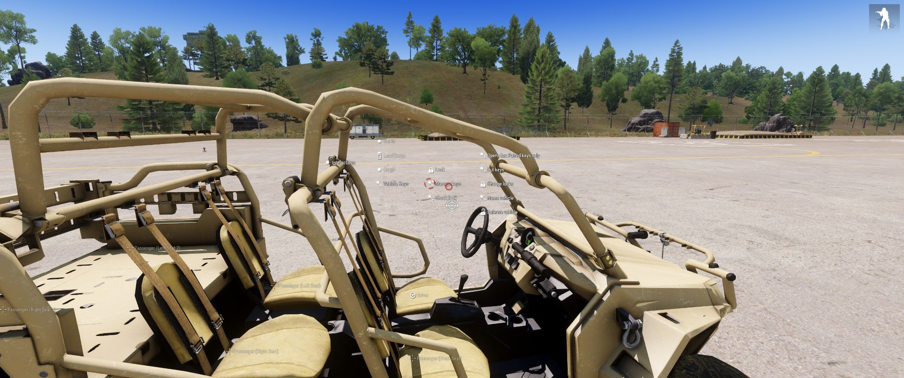
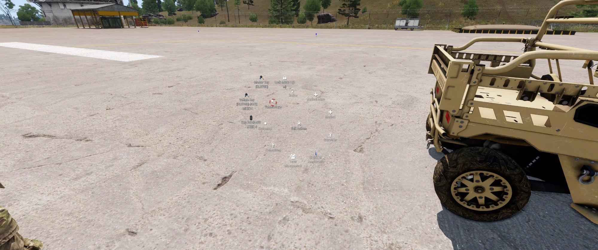
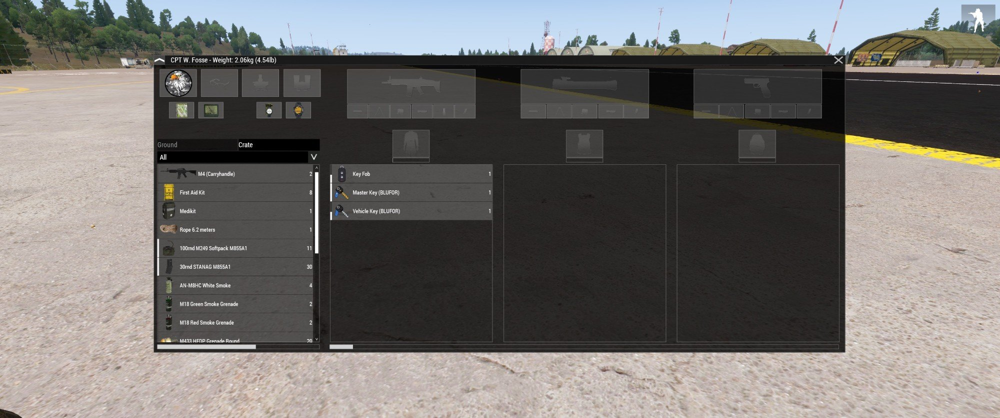

  

<h1 align="center">TLB Keys</h1>

  Vehicle keys for Arma 3 with ACE3, set up the way your unit plays. 
  <strong>Lock it for your side, your squad, or one key.</strong>

  <a href="https://github.com/TLB-MilSim/TLB-Keys/wiki/Player-Guide">Player guide</a> ·
  <a href="https://github.com/TLB-MilSim/TLB-Keys/wiki/Mission-Making">Mission making</a> ·
  <a href="https://github.com/TLB-MilSim/TLB-Keys/wiki/Settings">All settings</a> ·
  <a href="https://github.com/TLB-MilSim/TLB-Keys/wiki/How-It-Works">How it works</a> ·
  <a href="CHANGELOG.md">Changelog</a>

  

  
  

  
  

---

## What's new in 1.0.1

- **Lockpicking** with a lock pick kit, using TLB Interactions' or TSP Breach's
  kit when either is loaded.
- **Hotwiring** from the driver's seat of a vehicle you have no key for.
- **Key bindings** and three **key slots**, to lock up without opening a menu.
- **Vehicle types**: choose which kinds of vehicle use keys at all.
- Keys are no longer dropped on the ground when cut, paired or handed over.

See the [changelog](CHANGELOG.md) for the full list.

## What it is

ACE's vehicle keys open every vehicle of a side, and there is no good way to
hand one out in the middle of a mission. TLB Keys replaces them with keys your
players manage in the field, from the ACE interaction menu or a key binding.

**A vehicle nobody has locked is open.** The first player to lock one chooses
who else it opens for:

| Mode | Who gets in |
| --- | --- |
| **Every key of the side** | Anyone carrying a blank key of the vehicle's side. |
| **The owner's squad** | The owner's squad, carrying a blank key of the side. |
| **Paired keys only** | Only keys cut to that vehicle. The owner's key is cut as it is locked. |

Everything else is built around those three:

| Feature | What it gives you |
| --- | --- |
| **Spare keys** | Cut a blank key to the vehicle and hand it to someone. |
| **Change locks** | Every key cut for the vehicle stops fitting, spares included. |
| **Master keys** | One per side, for Zeus, command and the motor pool. Opens and manages every vehicle of that side, however it is locked. |
| **Key fobs** | Program one to a vehicle: it opens the vehicle and locks it from a distance, with a chirp. |
| **Key bindings** | Lock or unlock the nearest vehicle your keys open without opening a menu, plus three key slots for chosen keys. |
| **Ignition lock** | No key, no engine, even in the driver's seat. |
| **Locked cargo** | A locked vehicle's inventory stays shut to anyone whose keys do not fit. |
| **Inside handle** | Anyone in a seat can lock and unlock, like a real car door. |
| **Hand over key** | An ACE action on another player: no swapping inventories. |
| **Inspect and label** | See what a key opens, and name it, so a crate of motor pool keys stays readable. |
| **Lockpicking** | A lock pick kit opens vehicles your keys do not fit: on [TLB Interactions](https://github.com/TLB-MilSim/TLB-Interactions)' board when that mod is loaded, otherwise with a progress bar. TLB Keys ships a kit for servers that have neither TLB Interactions nor TSP Breach, and hides it when they do. |
| **Hotwiring** | Sitting in a vehicle your keys do not fit? Hotwire it from the driver's seat. Picked and hotwired vehicles start without a key until someone locks them again. |
| **Vehicle types** | Choose which kinds of vehicle use keys at all: cars, APCs, tanks, helicopters, planes, boats. |

**For mission makers:** sync vehicles, crates and units to a **Key Set** module
and they share one set of keys. A **Master Key** module hands out master keys,
every vehicle has TLB Keys attributes in Eden, and Zeus gets four modules.

**For servers:** around 40 CBA settings, all server-forced, so a unit can allow
one way of using keys or all of them.

## Requirements

| | |
| --- | --- |
| Arma 3 | v2.14 or newer |
| [CBA_A3](https://steamcommunity.com/workshop/filedetails/?id=450814997) | required |
| [ACE3](https://steamcommunity.com/workshop/filedetails/?id=463939057) | required |
| [TLB Interactions](https://github.com/TLB-MilSim/TLB-Interactions) | optional: vehicle locks are picked on its lockpicking board, with its lock pick kit and paperclip |
| [TSP Breach](https://steamcommunity.com/sharedfiles/filedetails/?id=3283645995) | optional: its lock pick kit and paperclip pick vehicle locks too |

## Installation

**Players:** subscribe on the Steam Workshop, or copy `@TLB Keys` into your Arma
3 folder, and load it with CBA_A3 and ACE3.

**Servers:**

1. Load `@TLB Keys` on the server **and** on every client.
2. Copy `keys\TLBKeys01.bikey` into the server's `keys` folder if you verify
   signatures.
3. Set the mod up in *Options → Addon Options → TLB Keys*, or in a
   `cba_settings.sqf`. Every setting is server-forced.

**From source:** run `.\tools\build.ps1`. The mod is written to
`release\@TLB Keys`. Add `-Sign` to sign it, or `-Deploy <folder>` to copy it
into your mods folder.

## Quick start

1. **Get a key.** Take a *Vehicle Key* for your side from the Arsenal, or from a
   crate the mission maker filled.
2. **Lock a vehicle.** ACE interaction on the vehicle → *Vehicle Keys* → *Lock
   for BLUFOR*, *Lock for my squad* or *Lock to my key*. You are now its owner.
3. **Manage it.** *Vehicle Keys → Manage keys* changes who it opens for, cuts
   spare keys, programs fobs, changes the locks, names it, gives it away or
   releases it.
4. **Check your keys.** ACE self-interaction → *Vehicle Keys* lists every key
   you carry: inspect, label, wipe, put one in a key slot, or use a fob.
5. **Bind a key.** *Options → Controls → Configure Addons → TLB Keys* to lock
   and unlock without the menu.

The [player guide](https://github.com/TLB-MilSim/TLB-Keys/wiki/Player-Guide) on the wiki walks through all of it with
examples and screenshots.

## Documentation

Everything lives on the **[wiki](https://github.com/TLB-MilSim/TLB-Keys/wiki)**, including a quick start and a
troubleshooting page.

| Page | For |
| --- | --- |
| [Quick start](https://github.com/TLB-MilSim/TLB-Keys/wiki/Quick-Start) | Players: your first key and your first locked vehicle, in five steps. |
| [Player guide](https://github.com/TLB-MilSim/TLB-Keys/wiki/Player-Guide) | Players: every feature, step by step, with examples and troubleshooting. |
| [Mission making](https://github.com/TLB-MilSim/TLB-Keys/wiki/Mission-Making) | Mission makers: Key Set and Master Key modules, vehicle attributes, Zeus modules, scripting. |
| [All settings](https://github.com/TLB-MilSim/TLB-Keys/wiki/Settings) | Server admins: every CBA setting with its default and effect, and an example settings file. |
| [How it works](https://github.com/TLB-MilSim/TLB-Keys/wiki/How-It-Works) | Developers: how keys store their cut, how access is decided, locality, how ACE is replaced. |
| [Key fobs and key bindings](https://github.com/TLB-MilSim/TLB-Keys/wiki/Key-Fobs-and-Key-Bindings) | Players: programming fobs, the three key slots, locking without a menu. |
| [Troubleshooting](https://github.com/TLB-MilSim/TLB-Keys/wiki/Troubleshooting) | Players: what to do when a key does not fit. |
| [Changelog](CHANGELOG.md) | Everyone: what changed in each version. |

## Compatibility

- **ACE vehicle lock:** its lock, unlock and lockpick actions are hidden, and
  its start-of-mission locking and inventory lock are switched off, while
  *Replace ACE vehicle locking* is on. ACE's side keys and master key keep
  working as TLB keys, and ACE's lockpick still picks locks.
- **Vanilla locking:** lock state is the vanilla `locked` value, so mission
  scripts that call `lock` keep working. A vehicle the mission locks without
  giving it keys starts unlocked, unless the settings say otherwise.
- **Vehicle types switched off** are left entirely to vanilla and ACE, with
  ACE's own lock actions back on them.
- **[TLB Interactions](https://github.com/TLB-MilSim/TLB-Interactions) and
  [TSP Breach](https://steamcommunity.com/sharedfiles/filedetails/?id=3283645995):**
  both are detected automatically and their lock pick kits pick vehicle locks,
  so nobody needs a second kit. With TLB Interactions loaded, picking happens on
  its board and its own settings choose the tool and whether it handles vehicles
  at all. Without it, one *Lock pick kit* setting picks between TSP Breach's kit
  and TLB Keys' own, and hides the other from the Arsenal.

## Licence

TLB Keys is licensed under the
**[Arma Public License No Derivatives (APL-ND)](https://www.bohemia.net/community/licenses/arma-public-license-nd)**.
You may share it unmodified, for non-commercial use, with attribution. You may not
modify it or publish derivative works. See [`LICENSE`](LICENSE).

## Credits

Made by **TLB MilSim**. All code, icons and sounds are original work; the item
pictures, menu icons and key fob chirps are generated by `tools/gen_assets.py`.
ACE3 and CBA_A3 are used through their public APIs only, and no code or assets
from other mods are included.

The wiki pages are generated from the `docs/` folder in this repository, so
the two stay in step.
